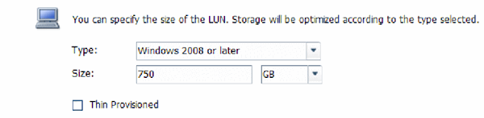

= LUN을 생성합니다
:allow-uri-read: 
:icons: font
:imagesdir: ../media/

[role="lead"]
LUN 생성 마법사를 사용하여 LUN을 생성합니다. 또한 이 마법사는 igroup을 생성하고 LUN을 igroup에 매핑하여 지정한 호스트에서 LUN에 액세스할 수 있도록 합니다.

.시작하기 전에
* LUN을 포함할 충분한 여유 공간이 있는 Aggregate가 있어야 합니다.
* FC 프로토콜을 사용하고 적절한 논리 인터페이스(LIF)를 생성하는 SVM(스토리지 가상 머신)이 있어야 합니다.
* 호스트 FC 포트의 WWPN(Worldwide Port Name)을 기록해야 합니다.

.이 작업에 대해
조직에 명명 규칙이 있는 경우 규칙에 맞게 LUN, 볼륨 등의 이름을 사용해야 합니다. 그렇지 않으면 기본 이름을 그대로 사용해야 합니다.

.단계
. LUN * 창으로 이동합니다.
. 생성 * 을 클릭합니다
. LUN을 생성할 SVM을 찾아 선택합니다.
+
LUN 생성 마법사가 표시됩니다.

. 일반 속성 * 페이지에서 Windows 호스트에서 직접 사용하는 LUN의 LUN 유형 * Windows 2008 이상 * 을 선택하거나 Hyper-V 가상 머신의 가상 하드 디스크(VHD)가 포함된 LUN의 경우 * Hyper-V * 를 선택합니다.
+
Thin Provisioned * 확인란을 선택하지 않은 상태로 둡니다.

+

. LUN 컨테이너 * 페이지에서 기존 FlexVol 볼륨을 선택합니다.
+
볼륨에 충분한 공간이 있는지 확인해야 합니다. 기존 볼륨에서 충분한 공간을 사용할 수 없는 경우 새 볼륨을 생성할 수 있습니다.

. 이니시에이터 매핑 * 페이지에서 * 이니시에이터 그룹 추가 * 를 클릭하고 * 일반 * 탭에 필요한 정보를 입력한 다음 * 이니시에이터 * 탭에서 기록한 호스트 FC 포트의 모든 WWPN을 입력합니다.
. 세부 정보를 확인한 다음 * 마침 * 을 클릭하여 마법사를 완료합니다.

* 관련 정보 *

https://docs.netapp.com/us-en/ontap/system-admin/index.html["시스템 관리"]
