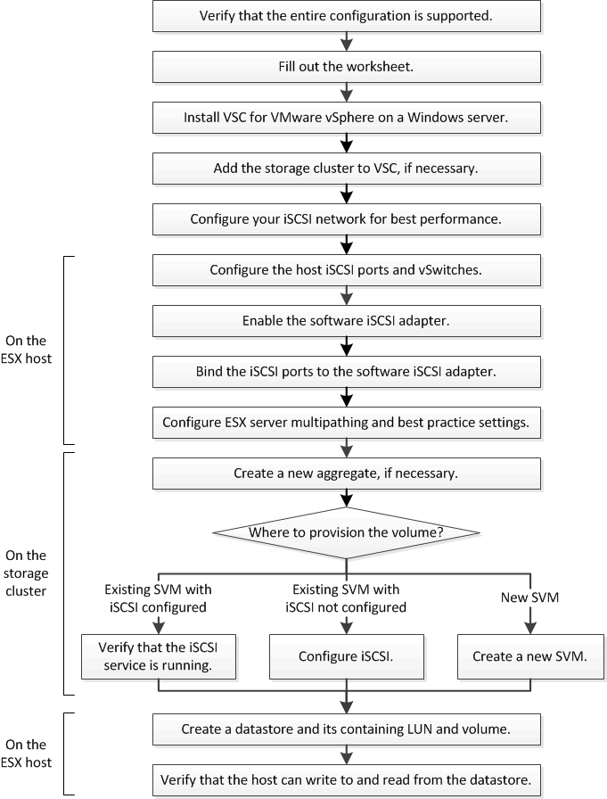

= iSCSI 구성 워크플로우
:allow-uri-read: 
:icons: font
:imagesdir: ../media/

[role="lead"]
iSCSI를 사용하여 ESXi 호스트에서 스토리지를 사용할 수 있게 하면 VMware vSphere용 Virtual Storage Console을 사용하여 SVM(스토리지 가상 머신)에서 볼륨 및 LUN을 프로비저닝하고 호스트에서 LUN에 연결합니다.

