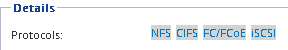

= 기존 SVM에서 iSCSI를 구성합니다
:allow-uri-read: 
:icons: font
:imagesdir: ../media/

[role="lead"]
기존 SVM(스토리지 가상 머신)에서 iSCSI를 구성할 수 있습니다. iSCSI 프로토콜은 SVM에서 이미 활성화되어 있지만 구성하지 않아야 합니다. 이 정보는 여러 프로토콜을 구성하지만 아직 iSCSI를 구성하지 않은 SVM용으로 제공됩니다.

.시작하기 전에
각 노드에 대해 2개의 LIF를 생성할 수 있는 충분한 네트워크 주소가 있어야 합니다.

.단계
. SVM * 창으로 이동합니다.
. 구성할 SVM을 선택합니다.
. SVM** Details** 창에서 * iSCSI * 가 회색 배경으로 표시되어 프로토콜이 활성화되었지만 완전히 구성되지 않았음을 나타냅니다.
+
iSCSI * 가 녹색 배경으로 표시되면 SVM이 이미 구성된 것입니다.

+

. 회색 배경이 있는 * iSCSI * 프로토콜 링크를 클릭합니다.
+
Configure iSCSI Protocol 창이 표시됩니다.

. iSCSI 프로토콜 구성 * 페이지에서 iSCSI 서비스 및 LIF를 구성합니다.
+
.. 대상 별칭 이름을 입력합니다.
.. 를 입력합니다 `*2*` LIF per node * 필드에서.
+
가용성과 데이터 이동성을 보장하기 위해 각 노드에 두 개의 LIF가 필요합니다.

.. 서브넷을 사용하거나 서브넷 없이 LIF의 IP 주소를 할당합니다.
.. LUN은 나중에 VMware vSphere용 Virtual Storage Console에 의해 프로비저닝되기 때문에 선택적인 * iSCSI 스토리지 * 영역에 대한 LUN 프로비저닝 * 을 무시합니다.
.. 제출 및 닫기 * 를 클릭합니다.

. 요약 * 페이지를 검토하고 LIF 정보를 기록한 다음 * 확인 * 을 클릭합니다.

