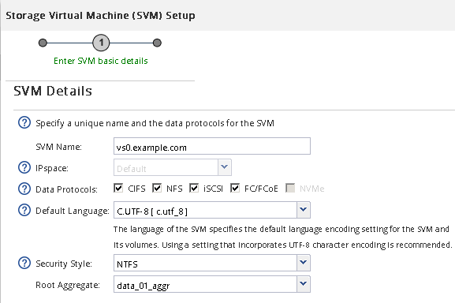

= 새 SVM을 생성합니다
:allow-uri-read: 
:icons: font
:imagesdir: ../media/

[role="lead"]
SVM(스토리지 가상 머신)은 호스트가 LUN에 액세스하는 데 사용하는 iSCSI 타겟을 제공합니다. SVM을 생성할 때 논리 인터페이스(LIF), LUN 및 포함된 볼륨도 생성합니다. SVM을 생성하여 클러스터의 다른 사용자 데이터와 사용자 관리 기능을 분리할 수 있습니다.

.시작하기 전에
* 각 노드에 대해 2개의 LIF를 생성할 수 있는 충분한 네트워크 주소가 있어야 합니다.

.이 작업에 대해
LUN은 호스트에서 LUN으로의 경로 수를 제한하기 위해 igroup의 이니시에이터 하위 집합에 매핑됩니다.

* 기본적으로 ONTAP에서는 SLM(Selective LUN Map)을 사용하여 LUN과 해당 HA 파트너를 소유하는 노드의 경로를 통해서만 LUN에 액세스할 수 있도록 합니다.
* LUN이 클러스터의 다른 노드로 이동하는 경우에도 LUN 이동성을 위해 모든 노드에 있는 iSCSI LIF를 구성해야 합니다.
* 볼륨 또는 LUN을 이동할 때 이동하기 전에 SLM-reporting-nodes 목록을 수정해야 합니다.

.단계
. SVM * 창으로 이동합니다.
. Create * 를 클릭합니다.
. SVM(Storage Virtual Machine) 설정 * 창에서 SVM을 생성합니다.
+

+
.. SVM의 고유한 이름을 지정합니다.
+
이름은 FQDN(정규화된 도메인 이름)이거나 클러스터 전체에서 고유한 이름을 보장하는 다른 규칙을 따라야 합니다.

.. SVM이 속할 IPspace를 선택합니다.
+
클러스터에서 여러 IPspace를 사용하지 않는 경우 "기본" IPspace가 사용됩니다.

.. 기본 볼륨 유형을 계속 선택합니다.
+
SAN 프로토콜에서는 FlexVol 볼륨만 지원됩니다.

.. 모든 프로토콜을 즉시 구성하지 않으려는 경우에도 라이센스가 있고 SVM에서 사용할 수 있는 프로토콜을 모두 선택하십시오.
+
SVM 생성 시 NFS와 CIFS를 모두 선택하면 이러한 두 프로토콜이 동일한 LIF를 공유할 수 있습니다. 이 프로토콜을 나중에 추가해도 LIF를 공유할 수 없습니다.

+
CIFS가 선택한 프로토콜 중 하나인 경우 보안 스타일이 NTFS로 설정됩니다. 그렇지 않으면 보안 스타일이 UNIX로 설정됩니다.

.. 기본 언어 설정 C. UTF-8을 유지합니다.
.. SVM 루트 볼륨을 포함할 루트 애그리게이트를 선택합니다.
+
데이터 볼륨의 애그리게이트는 이후 단계에서 별도로 선택됩니다.

.. 제출 및 계속 * 을 클릭합니다.

+
SVM이 생성되지만 프로토콜이 아직 구성되지 않았습니다.

. CIFS 또는 NFS를 설정했기 때문에 * CIFS/NFS 프로토콜 구성 * 페이지가 나타나면 * 건너뛰기 * 를 클릭한 다음 CIFS 또는 NFS를 나중에 구성합니다.
. iSCSI 서비스를 구성하고 LIF를 생성한 후 * iSCSI 프로토콜 구성 * 페이지에서 LUN 및 해당 볼륨:
+
.. * 선택 사항: * 대상 별칭 이름을 입력합니다.
.. 서브넷을 사용하거나 서브넷 없이 LIF의 IP 주소를 할당합니다.
.. 를 입력합니다 `*2*` LIF per node * 필드에서.
+
가용성과 데이터 이동성을 보장하기 위해 각 노드에 두 개의 LIF가 필요합니다.

.. iSCSI 스토리지용 LUN 프로비저닝 * 영역에서 원하는 LUN 크기, 호스트 유형 및 호스트의 iSCSI 이니시에이터 이름을 입력합니다.
.. 제출 및 계속 * 을 클릭합니다.

+
image::../media/svm_wizard_iscsi_details_windows.gif[그림 에서는 SVM 설정 마법사의 3단계, iSCSI 세부 정보 입력 과정을 보여 줍니다.]

. FC를 활성화했기 때문에 * FC/FCoE 프로토콜 구성 * 페이지가 나타나면 * 건너뛰기 * 를 클릭한 다음 나중에 FC를 구성합니다.
. SVM 관리 * 가 나타나면 이 SVM에 대한 별도의 관리자 구성을 구성하거나 연기합니다.
+
** Skip * (건너뛰기 *)을 클릭하고 나중에 필요에 따라 관리자를 구성합니다.
** 요청한 정보를 입력한 다음 * 제출 및 계속 * 을 클릭합니다.

. 요약 * 페이지를 검토하고 LIF 정보를 기록한 다음 * 확인 * 을 클릭합니다.

