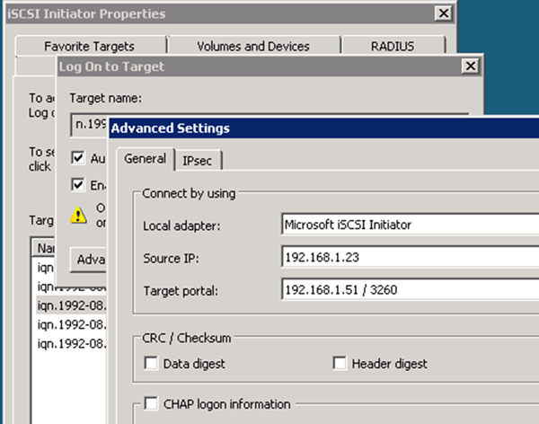

= 타겟으로 iSCSI 세션을 시작합니다
:allow-uri-read: 
:icons: font
:imagesdir: ../media/

[role="lead"]
Windows 호스트에는 클러스터의 각 노드에 대한 iSCSI 연결이 있어야 합니다. 호스트에서 iSCSI Initiator Properties 대화 상자를 사용하여 호스트에서 세션을 설정합니다.

.시작하기 전에
액세스하는 LUN이 포함된 SVM(스토리지 가상 머신)에서 iSCSI 데이터 LIF의 IP 주소를 알아야 합니다.

.이 작업에 대해
ONTAP에서 iSCSI 호스트에는 클러스터의 각 노드에 대한 경로가 있어야 합니다. 기본 DSM은 가장 적합한 경로를 선택합니다. 경로가 실패하면 기본 DSM이 대체 경로를 선택합니다.

iSCSI 초기자 속성 대화 상자의 단추와 레이블은 Windows 버전에 따라 다릅니다. 작업의 일부 단계에는 둘 이상의 단추나 레이블 이름이 포함되어 있습니다. 사용 중인 Windows 버전과 일치하는 이름을 선택해야 합니다.

.단계
. iSCSI 초기자 속성 * 대화 상자를 엽니다.
+
|===
| 대상... | 클릭... 

 a| 
Windows Server 2012 를 참조하십시오
 a| 
* 서버 관리자 * > * 대시보드 * > * 도구 * > * iSCSI 초기자 *

 a| 
Windows Server 2008 을 참조하십시오
 a| 
* 시작 * > * 관리 도구 * > * iSCSI 초기자 *

|===
. 검색 * 탭에서 * 포털 검색 * 또는 * 포털 추가 * 를 클릭한 다음 iSCSI 대상 포트의 IP 주소를 입력합니다.
. 대상 * 탭에서 검색한 대상을 선택한 다음 * 로그온 * 또는 * 연결 * 을 클릭합니다.
. 다중 경로 사용 * 을 선택하고 * 컴퓨터가 시작될 때 이 연결을 자동으로 복원 * 을 선택하거나 * 즐겨찾기 대상 목록에 이 연결 추가 * 를 선택한 다음 * 고급 * 을 클릭합니다.
. 로컬 어댑터 * 의 경우 * Microsoft iSCSI 초기자 * 를 선택합니다.
+
다음은 Windows Server 2008의 예입니다.

+

. 소스 IP * 또는 * 초기자 IP * 의 경우 iSCSI 대상 LIF 중 하나와 동일한 서브넷 또는 VLAN에 있는 포트의 IP 주소를 선택합니다.
. 나머지 확인란에 대한 기본값을 그대로 유지한 다음 * 확인 * 을 클릭합니다.
. 대상 * 탭에서 동일한 대상을 다시 선택한 다음 * 로그온 * 또는 * 연결 * 을 클릭합니다.
. 다중 경로 사용 * 을 선택하고 * 컴퓨터가 시작될 때 이 연결을 자동으로 복원 * 을 선택하거나 * 즐겨찾기 대상 목록에 이 연결 추가 * 를 선택한 다음 * 고급 * 을 클릭합니다.
. 소스 IP * 또는 * 초기자 IP * 의 경우, 다른 iSCSI 대상 LIF의 서브넷 또는 VLAN에 있는 다른 포트의 IP 주소를 선택합니다.
. 대상 포털 * 의 경우 * 소스 IP * 에 대해 선택한 포트에 해당하는 iSCSI 대상 LIF의 IP 주소를 선택합니다.
. 나머지 확인란에 대한 기본값을 그대로 유지한 다음 * 확인 * 을 클릭합니다.
. 8단계부터 12단계까지 반복하여 사용 가능한 각 타겟 LIF에 연결합니다.

