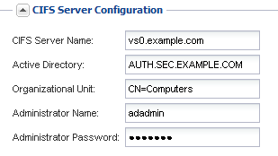

= 기존 SVM에 CIFS 및 NFS 액세스를 추가합니다
:allow-uri-read: 
:icons: font
:imagesdir: ../media/

[role="lead"]
기존 SVM에 CIFS/SMB 및 NFS 액세스를 모두 추가하려면 데이터 LIF를 생성하고, CIFS 서버를 구성하고, NFS를 사용하도록 설정하고, 선택적으로 NIS를 구성해야 합니다.

.시작하기 전에
* SVM에서 사용할 네트워킹 구성 요소는 무엇입니까?
+
** 노드 및 해당 노드의 특정 포트에서 데이터 논리 인터페이스(LIF)가 생성됩니다
** 데이터 LIF의 IP 주소를 프로비저닝할 서브넷 또는 선택적으로 데이터 LIF에 할당할 특정 IP 주소를 지정합니다
** SVM을 추가하는 데 필요한 자격 증명과 함께 SVM이 연결할 AD(Active Directory) 도메인입니다
** 사이트에서 NIS를 사용하여 이름 서비스 또는 이름 매핑을 사용하는 경우 NIS 정보입니다

* 모든 외부 방화벽은 네트워크 서비스에 대한 액세스를 허용하도록 적절하게 구성되어야 합니다.
* AD 도메인 컨트롤러, 클라이언트 및 SVM의 시간은 서로 5분 이내에 동기화해야 합니다.
* SVM에서 CIFS 및 NFS 프로토콜을 허용해야 합니다.
+
다른 프로토콜을 구성하면서 SVM을 생성하기 위해 이 절차를 따르지 않은 경우에 해당됩니다.

.이 작업에 대해
CIFS 및 NFS를 구성하는 순서는 표시되는 대화 상자에 영향을 줍니다. 이 절차에서는 CIFS를 먼저 구성하고 NFS를 다시 구성해야 합니다.

.단계
. SVM의 프로토콜을 구성할 수 있는 영역으로 이동합니다.
+
.. 구성할 SVM을 선택합니다.
.. Details * 창에서 * Protocols * 옆에 있는 * CIFS * 를 클릭합니다.
+
image::../media/svm_add_protocol_multi_1st_cifs.gif[이 이미지는 주변 텍스트로 설명됩니다.]

. CIFS 프로토콜 구성 * 대화 상자의 * 데이터 LIF 구성 * 섹션에서 SVM용 데이터 LIF를 생성합니다.
+
.. 지정한 서브넷에서 자동으로 LIF에 IP 주소를 할당하거나 수동으로 주소를 입력합니다.
.. 찾아보기 * 를 클릭하고 LIF와 연결할 노드와 포트를 선택합니다.
+
image::../media/svm_setup_cifs_nfs_page_lif_multi_nas_nas_mp.gif[이 그래픽은 주변 텍스트로 설명됩니다.]

. CIFS 서버 구성 * 섹션에서 CIFS 서버를 정의하고 AD 도메인에 액세스하도록 구성합니다.
+
.. AD 도메인에서 고유한 CIFS 서버의 이름을 지정합니다.
.. CIFS 서버가 연결할 수 있는 AD 도메인의 FQDN을 지정합니다.
.. CN=Computers가 아닌 AD 도메인 내의 OU(조직 구성 단위)를 연결하려면 OU를 입력합니다.
.. OU에 CIFS 서버를 추가할 수 있는 권한이 충분한 관리 계정의 이름과 암호를 지정합니다.
.. 이 SVM의 모든 공유에 대한 무단 액세스를 방지하려면 SMB 3.0을 사용하여 데이터를 암호화하는 옵션을 선택합니다.

+

. CIFS/SMB 액세스를 위한 볼륨을 생성하고 이 볼륨에서 공유를 프로비저닝합니다.
+
.. CIFS/SMB 클라이언트가 볼륨을 액세스하는 데 사용할 공유의 이름을 지정합니다.
+
공유에 대해 입력한 이름도 볼륨 이름으로 사용됩니다.

.. 볼륨의 크기를 지정합니다.
+
image::../media/svm_setup_cifs_nfs_page_cifs_share_nas_mp.gif[CIFS 공유를 구성하는 영역의 스크린 샷]

+
가장 사용 가능한 공간이 있는 애그리게이트에 자동으로 있으므로 볼륨의 애그리게이트를 지정할 필요가 없습니다.

. CIFS 스토리지 * 영역에 볼륨 용량 할당을 건너뛰십시오. 다중 프로토콜 액세스가 아닌 CIFS 액세스에만 볼륨을 프로비저닝하기 때문입니다.
. 제출 및 닫기 * 를 클릭한 다음 * 확인 * 을 클릭합니다.
. NFS 설정:
+
.. SVM 탭에서 NFS를 활성화할 SVM을 선택하고 * 관리 * 를 클릭합니다.
.. 프로토콜 * 창에서 * NFS * 를 클릭한 다음 * 활성화 * 를 클릭합니다.

. 사이트에서 NIS를 사용하여 이름 서비스 또는 이름 매핑을 사용하는 경우 NIS를 구성합니다.
+
.. 서비스 * 창에서 * NIS * 를 클릭합니다.
.. NIS * 창에서 * 생성 * 을 클릭합니다.
.. NIS 서버의 도메인을 지정합니다.
.. NIS 서버의 IP 주소를 추가합니다.
.. 스토리지 가상 머신 * 에 대해 도메인 활성화 를 선택한 다음 * 생성 * 을 클릭합니다.

+

== 다음 단계

SVM 루트 볼륨의 엑스포트 정책을 엽니다.
