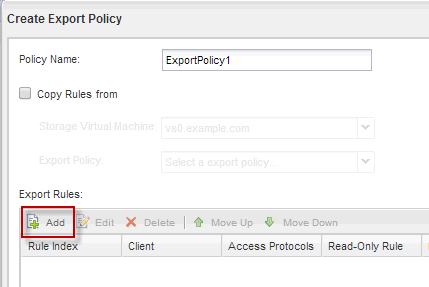

= 볼륨에 대한 엑스포트 정책을 생성합니다
:allow-uri-read: 
:icons: font
:imagesdir: ../media/

[role="lead"]
NFS 클라이언트가 볼륨에 액세스하려면 먼저 볼륨에 대한 엑스포트 정책을 생성하고 관리 호스트의 액세스를 허용하는 규칙을 추가한 다음 새 엑스포트 정책을 볼륨에 적용해야 합니다.

.단계
. SVM * 창으로 이동합니다.
. SVM 설정 * 탭을 클릭합니다.
. 새 엑스포트 정책 생성:
+
.. Policies * 창에서 * Export Policies * 를 클릭한 다음 * Create * 를 클릭합니다.
.. Create Export Policy * 창에서 정책 이름을 지정합니다.
.. 내보내기 규칙 * 에서 * 추가 * 를 클릭하여 새 정책에 규칙을 추가합니다.

+

. 내보내기 규칙 만들기 * 대화 상자에서 관리자가 모든 프로토콜을 통해 내보내기에 완전히 액세스할 수 있도록 하는 규칙을 만듭니다.
+
.. 내보낸 볼륨을 관리할 IP 주소 또는 클라이언트 이름(예: admin_host)을 지정합니다.
.. CIFS * 및 * NFSv3 * 을 선택합니다.
.. 모든 * 읽기/쓰기 * 액세스 세부 정보와 * 고급 사용자 액세스 허용 * 이 선택되어 있는지 확인합니다.
+
image::../media/export_rule_for_admin_manual_multi_nas_mp.gif[이 스크린샷은 이전 텍스트로 설명됩니다.]

.. OK * 를 클릭한 다음 * Create * 를 클릭합니다.

+
새 엑스포트 정책과 새 규칙이 함께 생성됩니다.

. 새 볼륨에 새 내보내기 정책을 적용하여 관리자 호스트가 볼륨에 액세스할 수 있도록 합니다.
+
.. Namespace* 창으로 이동합니다.
.. 볼륨을 선택하고 * 내보내기 정책 변경 * 을 클릭합니다.
.. 새 정책을 선택하고 * 변경 * 을 클릭합니다.

