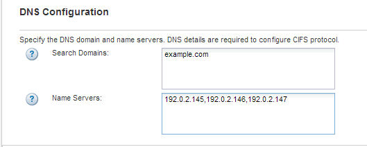

= 새 NFS 지원 SVM을 생성합니다
:allow-uri-read: 
:icons: font
:imagesdir: ../media/

[role="lead"]
새 SVM을 설정하려면 새로운 NFS를 생성하고 설정해야 합니다. 그런 다음 ESXi 호스트에서 NFS 액세스를 구성하고 가상 스토리지 콘솔을 사용하여 ESXi에 대해 NFS가 활성화되었는지 확인할 수 있습니다.

.시작하기 전에
* 네트워크를 구성해야 하며 관련 물리적 포트를 네트워크에 연결해야 합니다.
* 에서 사용할 네트워킹 구성 요소는 다음 중 어느 것입니까?
+
** 노드 및 해당 노드의 특정 포트에서 데이터 논리 인터페이스(LIF)가 생성됩니다
** 데이터 LIF의 IP 주소를 프로비저닝할 서브넷 또는 선택적으로 데이터 LIF에 할당할 특정 IP 주소를 지정합니다

* 모든 외부 방화벽은 네트워크 서비스에 대한 액세스를 허용하도록 적절하게 구성되어야 합니다.

.이 작업에 대해
SVM 생성, DNS 구성, 데이터 LIF 생성 및 NFS 설정 프로세스를 안내하는 마법사를 사용할 수 있습니다.

.단계
. SVM * 창으로 이동합니다.
. Create * 를 클릭합니다.
. SVM(Storage Virtual Machine) 설정 * 창에서 SVM을 생성합니다.
+
.. SVM의 고유한 이름을 지정합니다.
+
이름은 FQDN(정규화된 도메인 이름)이거나 클러스터 전체에서 고유한 이름을 보장하는 다른 규칙을 따라야 합니다.

.. 데이터 프로토콜로 * nfs * 를 선택합니다.
+
동일한 SVM에서 추가 프로토콜을 사용할 계획이라면 프로토콜을 즉시 구성하지 않아도 됩니다.

.. 기본 언어 설정인 C. UTF-8을 유지합니다.
+
이 언어는 나중에 생성한 볼륨에 의해 상속되며 볼륨의 언어는 변경할 수 없습니다.

.. * 선택 사항 *: CIFS 프로토콜을 활성화한 경우 보안 스타일을 * UNIX * 로 변경합니다.
+
CIFS 프로토콜을 선택하면 기본적으로 보안 스타일이 NTFS로 설정됩니다.

.. * 선택 사항 *: 루트 볼륨을 포함할 루트 애그리게이트를 선택합니다.
+
루트 볼륨에 대해 선택한 aggregate에서 데이터 볼륨의 위치가 결정되지 않습니다.

+
image::../media/svm_setup_details_unix_selected_nfs_esxi.gif[SVM 설정]

.. * 선택 사항 *: * DNS Configuration * 영역에서 기본 DNS 검색 도메인과 네임 서버가 이 SVM에 사용할 것인지 확인합니다.
+

.. 제출 및 계속 * 을 클릭합니다.

+
가 생성되지만 프로토콜이 아직 구성되지 않았습니다.

. CIFS/NFS 프로토콜 구성 * 페이지의 * 데이터 LIF 구성 * 섹션에서 첫 번째 데이터 저장소의 첫 번째 데이터 LIF에 대한 세부 정보를 지정합니다.
+
.. 지정한 서브넷에서 자동으로 LIF에 IP 주소를 할당하거나 수동으로 주소를 입력합니다.
.. 찾아보기 * 를 클릭하고 LIF와 연결할 노드와 포트를 선택합니다.
+
image::../media/svm_setup_cifs_nfs_page_lif_multi_nas_nfs_esxi.gif[이 그래픽은 주변 텍스트로 설명됩니다.]

+
볼륨 용량을 할당할 정보를 입력하지 마십시오. 나중에 를 사용하여 데이터 저장소를 프로비저닝할 수 있습니다

. 제출 및 계속 * 을 클릭합니다.
+
다음 오브젝트가 생성됩니다.

+
** 뒤에 ""_nfs_lif1" 접미사가 붙은 데이터 LIF
** NFS 서버

. 표시되는 다른 모든 프로토콜 구성 페이지의 경우 * Skip * (건너뛰기 *)을 클릭한 다음 나중에 프로토콜을 구성합니다.
. SVM 관리 * 페이지가 표시되면 이 SVM에 대한 별도의 관리자 구성을 구성하거나 연기합니다.
+
** Skip * 을 클릭한 다음 필요에 따라 나중에 관리자를 구성합니다.
** 요청한 정보를 입력한 다음 * 제출 및 계속 * 을 클릭합니다.

. 요약 * 페이지를 검토하고 나중에 필요한 정보를 모두 기록한 다음 * 확인 * 을 클릭합니다.
+
NFS 클라이언트는 데이터 LIF의 IP 주소를 알아야 합니다.

.결과
NFS를 사용하도록 설정하면 새 SVM이 생성됩니다.
