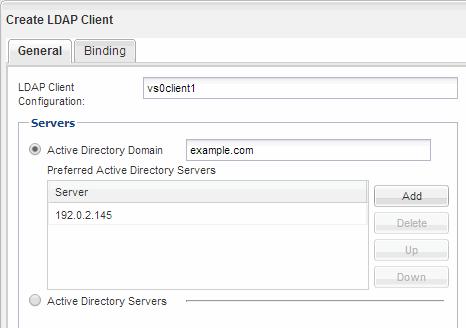
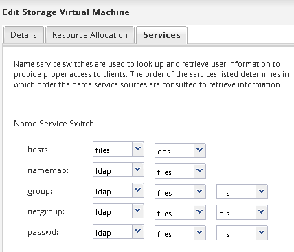

= LDAP 구성(기존 SVM에 대한 NFS 액세스 구성)
:allow-uri-read: 
:icons: font
:imagesdir: ../media/

[role="lead"]
SVM(스토리지 가상 시스템)에서 Active Directory 기반 LDAP(Lightweight Directory Access Protocol)의 사용자 정보를 가져오려면 LDAP 클라이언트를 생성하고 SVM용으로 설정한 다음 다른 사용자 정보 소스보다 LDAP 우선 순위를 지정해야 합니다.

.시작하기 전에
* LDAP 구성은 AD(Active Directory)를 사용해야 합니다.
+
다른 유형의 LDAP를 사용하는 경우 LDAP를 구성하려면 CLI(Command-Line Interface) 및 기타 설명서를 사용해야 합니다. 자세한 내용은 을 참조하십시오 link:https://docs.netapp.com/us-en/ontap/nfs-config/using-ldap-concept.html["LDAP 사용 개요"^].

* AD 도메인 및 서버는 물론 인증 레벨, Bind 사용자 및 암호, 기본 DN 및 LDAP 포트와 같은 바인딩 정보를 알아야 합니다.

.단계
. SVM * 창으로 이동합니다.
. 필요한 SVM을 선택합니다
. SVM 설정 * 탭을 클릭합니다.
. SVM에서 사용할 LDAP 클라이언트 설정:
+
.. 서비스 * 창에서 * LDAP 클라이언트 * 를 클릭합니다.
.. LDAP 클라이언트 구성 * 창에서 * 추가 * 를 클릭합니다.
.. LDAP 클라이언트 생성 * 창의 * 일반 * 탭에서 와 같이 LDAP 클라이언트 구성의 이름을 입력합니다 `vs0client1`.
.. AD 도메인 또는 AD 서버를 추가합니다.
+

.. Binding * 을 클릭하고 인증 수준, Bind 사용자 및 암호, 기본 DN 및 포트를 지정합니다.
+
image::../media/ldap_client_creation_binding_tab_nfs.gif[이 이미지는 주변 텍스트로 설명됩니다.]

.. 저장 후 닫기 * 를 클릭합니다.

+
SVM에서 사용할 수 있도록 새 클라이언트가 생성되고 제공됩니다.

. SVM을 위한 새 LDAP 클라이언트 지원:
+
.. 탐색 창에서 * LDAP Configuration * 을 클릭합니다.
.. 편집 * 을 클릭합니다.
.. 방금 생성한 클라이언트가 * LDAP 클라이언트 이름 * 에서 선택되었는지 확인합니다.
.. LDAP 클라이언트 활성화 * 를 선택하고 * 확인 * 을 클릭합니다.
+
image::../media/ldap_svm_configuration_active_ldap_client_nfs.gif[이 이미지는 주변 텍스트로 설명됩니다.]

+
SVM은 새 LDAP 클라이언트를 사용합니다.

. NIS(Network Information Service), 로컬 사용자 및 그룹과 같은 다른 사용자 정보 소스보다 LDAP 우선 순위를 지정합니다.
+
.. SVM * 창으로 이동합니다.
.. SVM을 선택하고 * Edit * 를 클릭합니다.
.. 서비스 * 탭을 클릭합니다.
.. 이름 서비스 스위치 * 에서 * LDAP * 를 데이터베이스 유형의 기본 이름 서비스 스위치 소스로 지정합니다.
.. 저장 후 닫기 * 를 클릭합니다.

+

+
를 누릅니다
LDAP는 이 SVM에서 이름 서비스와 이름 매핑을 위한 기본 사용자 정보입니다.

