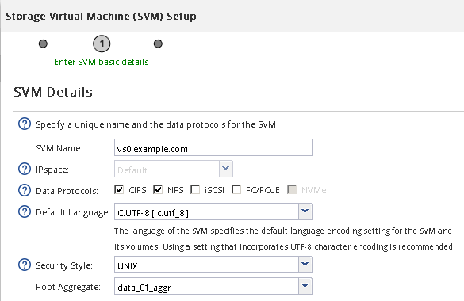

= NFS 볼륨으로 새 SVM을 생성하고 내보냅니다
:allow-uri-read: 
:icons: font
:imagesdir: ../media/

[role="lead"]
마법사를 사용하면 SVM(스토리지 가상 시스템) 생성, DNS(Domain Name System) 구성, LIF(데이터 논리 인터페이스) 생성, NFS 설정, NIS 구성 옵션, 볼륨 생성 및 내보내기 프로세스를 안내합니다.

.시작하기 전에
* 네트워크를 구성해야 하며 관련 물리적 포트를 네트워크에 연결해야 합니다.
* SVM에서 사용할 네트워킹 구성 요소는 무엇입니까?
+
** 노드 및 해당 노드의 특정 포트에서 데이터 논리 인터페이스(LIF)가 생성됩니다
** 데이터 LIF의 IP 주소를 프로비저닝할 서브넷 또는 선택적으로 데이터 LIF에 할당할 특정 IP 주소를 지정합니다
** NIS 정보 - 사이트에서 이름 서비스 또는 이름 매핑에 NIS를 사용하는 경우

* 서브넷은 NIS(Network Information Service), LDAP(Lightweight Directory Access Protocol), AD(Active Directory) 및 DNS와 같은 서비스에 필요한 모든 외부 서버로 라우팅할 수 있어야 합니다.
* 모든 외부 방화벽은 네트워크 서비스에 대한 액세스를 허용하도록 적절하게 구성되어야 합니다.
* AD 도메인 컨트롤러, 클라이언트 및 SVM의 시간은 서로 5분 이내에 서로 동기화해야 합니다.

.단계
. SVM * 창으로 이동합니다.
. 생성 * 을 클릭합니다
. SVM(Storage Virtual Machine) 설정 * 대화 상자에서 SVM을 생성합니다.
+
.. SVM의 고유한 이름을 지정합니다.
+
이름은 FQDN(정규화된 도메인 이름)이거나 클러스터 전체에서 고유한 이름을 보장하는 다른 규칙을 따라야 합니다.

.. 모든 프로토콜을 즉시 구성하지 않아도 라이센스가 있고 SVM에서 사용할 프로토콜을 모두 선택합니다.
+
CIFS 액세스가 최종적으로 필요한 경우 CIFS와 NFS 클라이언트가 동일한 데이터 LIF를 공유할 수 있도록 * cifs * 를 지금 선택해야 합니다.

.. 기본 언어 설정인 C. UTF-8을 유지합니다.
+
[NOTE]
====
NFS 및 SMB/CIFS 클라이언트 모두에서 국제 문자 표시를 지원하는 경우 ONTAP 9.5부터 사용할 수 있는 * UTF8MB4 * 언어 코드를 사용하는 것이 좋습니다.

====
+
이 언어는 나중에 생성한 볼륨에 의해 상속되며 볼륨의 언어는 변경할 수 없습니다.

.. * 선택 사항 *: CIFS 프로토콜을 활성화한 경우 보안 스타일을 * UNIX * 로 변경합니다.
+
CIFS 프로토콜을 선택하면 기본적으로 보안 스타일이 NTFS로 설정됩니다.

.. * 선택 사항 *: SVM 루트 볼륨을 포함할 루트 애그리게이트를 선택합니다.
+
루트 볼륨에 대해 선택한 aggregate에서 데이터 볼륨의 위치가 결정되지 않습니다. 이후 단계에서 스토리지를 프로비저닝할 때 데이터 볼륨의 애그리게이트는 자동으로 선택됩니다.

+

.. DNS Configuration * 영역에서 기본 DNS 검색 도메인 및 이름 서버가 이 SVM에 사용할 서버인지 확인합니다.
+
image::../media/svm_setup_details_dns_nfs.gif[이 그래픽은 주변 텍스트로 설명됩니다.]

.. 제출 및 계속 * 을 클릭합니다.

+
SVM이 생성되지만 프로토콜이 아직 구성되지 않았습니다.

. CIFS/NFS 프로토콜 구성 * 페이지의 * 데이터 LIF 구성 * 섹션에서 클라이언트가 데이터에 액세스하는 데 사용할 LIF의 세부 정보를 지정합니다.
+
.. 지정한 서브넷에서 자동으로 LIF에 IP 주소를 할당하거나 수동으로 주소를 입력합니다.
.. 찾아보기 * 를 클릭하고 LIF와 연결할 노드와 포트를 선택합니다.
+
image::../media/svm_setup_cifs_nfs_page_lif_multi_nas_nfs.gif[이 그래픽은 주변 텍스트로 설명됩니다.]

. NIS 구성 * 영역이 축소되면 확장합니다.
. 사이트에서 NIS를 이름 서비스 또는 이름 매핑에 사용하는 경우 NIS 서버의 도메인 및 IP 주소를 지정합니다.
+
image::../media/svm_setup_cifs_nfs_page_nis_area_nfs.gif[이 그래픽은 주변 텍스트로 설명됩니다.]

. NFS 액세스를 위한 볼륨 생성 및 내보내기:
+
.. 내보내기 이름 * 에 내보내기 이름과 볼륨 이름의 시작 이름을 입력합니다.
.. 파일을 포함할 볼륨의 크기를 지정합니다.
+
image::../media/svm_setup_cifs_nfs_page_nfs_export_nfs.gif[NFS 내보내기를 구성하는 영역의 스크린 샷]

+
가장 사용 가능한 공간이 있는 애그리게이트에 자동으로 있으므로 볼륨의 애그리게이트를 지정할 필요가 없습니다.

.. permission * 필드에서 * Change * 를 클릭하고 superuser 액세스를 포함하여 UNIX 관리 호스트에 대한 NFSv3 액세스를 제공하는 엑스포트 규칙을 지정합니다.
+
image::../media/export_rule_for_admin_manual_nfs_nfs.gif[이 이미지는 주변 텍스트로 설명됩니다.]

+
Eng라는 이름의 10GB 볼륨을 생성하고, Eng로 내보내고, 슈퍼유저 액세스를 포함하여 ""admin_host"" 클라이언트에 내보내기 전체 액세스 권한을 부여하는 규칙을 추가할 수 있습니다.

. 제출 및 계속 * 을 클릭합니다.
+
다음 오브젝트가 생성됩니다.

+
** ""_nfs_lif1" 접미사를 사용하여 SVM 뒤에 이름이 지정된 데이터 LIF
** NFS 서버
** 가용 공간이 가장 많은 애그리게이트에 있는 볼륨의 내보내기 이름과 일치하고 접미사 ""_nfs_volume""로 끝나는 이름입니다.
** 볼륨의 내보내기입니다
** 내보내기 이름과 같은 이름의 엑스포트 정책

. 표시되는 다른 모든 프로토콜 구성 페이지의 경우 * Skip * (건너뛰기 *)을 클릭하고 나중에 프로토콜을 구성합니다.
. SVM 관리 * 페이지가 표시되면 이 SVM에 대한 별도의 관리자 구성을 구성하거나 연기합니다.
+
** Skip * 을 클릭하고 필요한 경우 나중에 관리자를 구성합니다.
** 요청된 정보를 입력한 다음 * 제출 및 계속 * 을 클릭합니다.

. 요약 * 페이지를 검토하고 나중에 필요한 정보를 모두 기록한 다음 * 확인 * 을 클릭합니다.
+
NFS 클라이언트는 데이터 LIF의 IP 주소를 알아야 합니다.

.결과
관리자를 위해 내보낸 새 볼륨이 포함된 NFS 서버를 통해 새 SVM이 생성됩니다.
