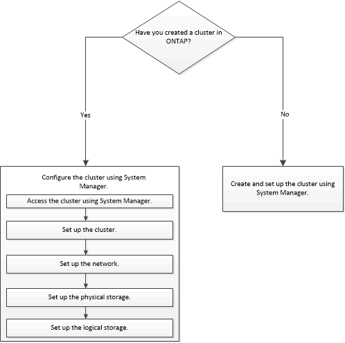

= 클러스터 환경 설정
:allow-uri-read: 
:icons: font
:imagesdir: ../media/

[role="lead"]
System Manager 또는 CLI(Command-Line Interface)를 사용하여 클러스터를 생성할 수 있습니다. System Manager를 사용하여 클러스터를 생성하려면 클러스터 네트워크의 모든 노드에서 노드 관리 IP 주소를 설정해야 합니다. CLI를 사용하여 클러스터를 생성한 경우 System Manager를 사용하여 클러스터를 구성할 수 있습니다.

