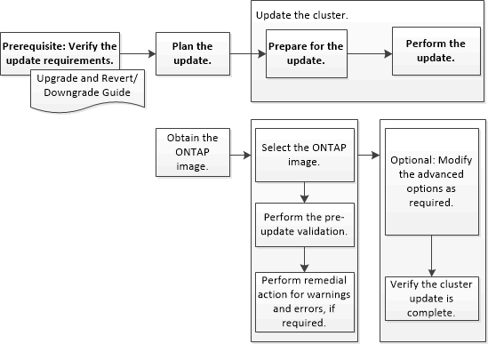

= System Manager-ONTAP 9.7 이하를 사용하여 비 MetroCluster 구성에서 클러스터를 업데이트합니다
:allow-uri-read: 
:icons: font
:imagesdir: ../media/

[role="lead"]
ONTAP ONTAP 9.7 이하에서 사용 가능한 System Manager의 기존 버전을 사용하여 고가용성(HA) 쌍의 클러스터 또는 개별 노드를 업데이트할 수 있습니다. 업데이트를 수행하려면 ONTAP 이미지를 선택하고 클러스터 또는 HA 쌍의 개별 노드가 업데이트 준비가 되었는지 확인한 다음 업데이트를 수행해야 합니다.

* 관련 정보 *

https://docs.netapp.com/us-en/ontap/upgrade/task_upgrade_andu_sm.html["ONTAP를 업그레이드합니다"]
