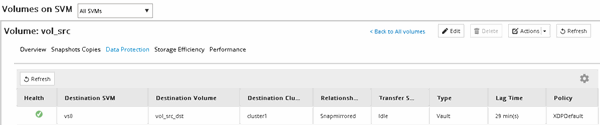

= SnapVault 관계 생성(ONTAP 9.3부터 시작)
:allow-uri-read: 
:icons: font
:imagesdir: ../media/

[role="lead"]
피어링된 클러스터에서 소스 볼륨과 타겟 볼륨 간에 SnapVault 관계를 생성하여 SnapVault 백업을 생성해야 합니다.

.시작하기 전에
* 대상 클러스터에 대한 클러스터 관리자 사용자 이름과 암호가 있어야 합니다.
* 대상 Aggregate에 사용 가능한 공간이 있어야 합니다.

.이 작업에 대해
소스 * 클러스터에서 이 작업을 수행해야 합니다.

.단계
. 스토리지 * > * 볼륨 * 을 클릭합니다.
. 백업할 볼륨을 선택한 다음 * 작업 * > * 보호 * 를 클릭합니다.
+
여러 소스 볼륨을 선택한 다음 단일 타겟 볼륨으로 SnapVault 관계를 생성할 수도 있습니다.

. Volumes:Protect Volumes * 페이지에서 다음 정보를 제공합니다.
+
.. 관계 유형 * 드롭다운 목록에서 * 볼트 * 를 선택합니다.
.. 타겟 클러스터, 타겟 SVM 및 타겟 볼륨의 접미사를 선택합니다.
+
피어링된 SVM과 허용된 SVM만 타겟 SVM 아래에 나열됩니다.

+
대상 볼륨이 자동으로 생성됩니다. 대상 볼륨의 이름은 접미사가 추가된 소스 볼륨 이름입니다.

.. 을 클릭합니다 image:../media/advanced_options_icon_backup.gif[""].
.. 고급 옵션 * 대화 상자에서 * 보호 정책 * 이 로 설정되어 있는지 확인합니다 `XDPDefault`.
.. 보호 일정 * 을 선택합니다.
+
기본적으로 은(는) 입니다 `daily` 일정이 선택되었습니다.

.. SnapVault 관계를 초기화하기 위해 * 예 * 가 선택되어 있는지 확인합니다.
+
모든 데이터 보호 관계는 기본적으로 초기화됩니다.

.. 변경 사항을 저장하려면 * 적용 * 을 클릭합니다.
+
image::../media/snapvault_advanced_options.gif[SnapVault 고급 옵션]

. Volumes:Protect Volumes * 페이지에서 * Validate * 를 클릭하여 볼륨에 일치하는 SnapMirror 레이블이 있는지 확인합니다.
. SnapVault 관계를 만들려면 * 저장 * 을 클릭합니다.
. SnapVault 관계 상태가 에서 인지 확인합니다 `Snapmirrored` 상태.
+
.. Volumes * 창으로 이동한 다음 백업할 볼륨을 선택합니다.
.. 볼륨을 확장하고 * 보호 * 를 클릭하여 볼륨의 데이터 보호 상태를 확인합니다.

+

