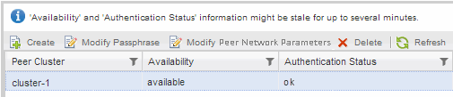

= 클러스터 피어 관계 및 SVM 피어 관계를 확인합니다
:allow-uri-read: 
:icons: font
:imagesdir: ../media/

[role="lead"]
SnapVault 기술을 사용하여 데이터 보호를 위한 볼륨을 설정하기 전에 소스 클러스터와 타겟 클러스터가 피어 관계를 통해 서로 피어링되어 상호 통신하고 있는지 확인해야 합니다. 또한 소스 SVM과 타겟 SVM이 피어링되어 피어 관계를 통해 서로 통신하고 있는지 확인해야 합니다.

.이 작업에 대해
소스 * 클러스터에서 이 작업을 수행해야 합니다.

== 절차를 참조하십시오

* ONTAP 9.3 이상을 실행 중인 경우 다음 단계를 수행하여 클러스터 피어 관계 및 SVM 피어 관계를 확인하십시오.
+
.. 구성 * > * 클러스터 피어 * 를 클릭합니다.
.. 피어링된 클러스터가 인증되었으며 사용 가능한지 확인합니다.
+
image::../media/cluster_pper_930_backup.gif[클러스터 퍼 930 백업]

.. 구성 * > * SVM 피어 * 를 클릭합니다.
.. 대상 SVM이 소스 SVM으로 피어링되었는지 확인합니다.

* ONTAP 9.2 이하를 실행 중인 경우 다음 단계를 수행하여 클러스터 피어 관계 및 SVM 피어 관계를 확인하십시오.
+
.. 구성 * 탭을 클릭합니다.
.. 클러스터 세부 정보 * 창에서 * 클러스터 피어 * 를 클릭합니다.
.. 피어링된 클러스터가 인증되고 사용 가능한지 확인합니다.
+

.. SVM * 탭을 클릭하고 소스 SVM을 선택합니다.
.. 피어 스토리지 가상 시스템 * 영역에서 대상 SVM이 소스 SVM으로 피어링되었는지 확인합니다.
+
이 영역에서 피어링된 SVM이 없는 경우 SnapVault 관계를 생성할 때 SVM 피어 관계를 생성할 수 있습니다.

+
xref:task_creating_snapvault_relationship_92_earlier.adoc[SnapVault 관계 만들기(ONTAP 9.2 이하)]

