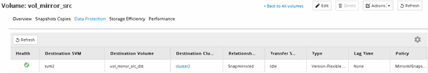

= SnapMirror 관계 생성(ONTAP 9.3부터)
:allow-uri-read: 
:icons: font
:imagesdir: ../media/

[role="lead"]
한 클러스터의 소스 볼륨과 재해 복구를 위한 데이터 복제를 위한 피어링된 클러스터의 타겟 볼륨 간에 SnapMirror 관계를 생성해야 합니다.

.시작하기 전에
* 대상 Aggregate에 사용 가능한 공간이 있어야 합니다.
* 사용자 액세스, 인증 및 클라이언트 액세스를 위한 환경 요구 사항을 충족하도록 두 클러스터를 적절히 구성 및 설정해야 합니다.

.이 작업에 대해
소스 * 클러스터에서 이 작업을 수행해야 합니다.

.단계
. 스토리지 * > * 볼륨 * 을 클릭합니다.
. 미러 관계를 생성할 볼륨을 선택한 다음 * 작업 * > * 보호 * 를 클릭합니다.
. 관계 유형 * 섹션의 * 관계 유형 * 드롭다운 목록에서 * 미러 * 를 선택합니다.
. Volumes:Protect Volumes * 페이지에서 다음 정보를 제공합니다.
+
.. 관계 유형으로 * 미러 * 를 선택합니다.
.. 타겟 클러스터, 타겟 SVM 및 타겟 볼륨 이름의 접미사를 선택합니다.
+
피어링된 SVM과 허용된 SVM만 타겟 SVM 아래에 나열됩니다.

.. 을 클릭합니다 image:../media/advanced_options_icon_disaster.gif["고급 옵션 아이콘"].
.. 고급 옵션 * 대화 상자에서 를 확인합니다 `MirrorAllSnapshots` 보호 정책으로 설정됩니다.
+
`DPDefault` 및 `MirrorLatest` 는 SnapMirror 관계에 사용할 수 있는 다른 기본 보호 정책입니다.

.. 보호 스케줄을 선택합니다.
+
기본적으로 은(는) 입니다 `hourly` 일정이 선택되었습니다.

.. SnapVault 관계를 초기화하기 위해 * 예 * 가 선택되어 있는지 확인합니다.
+
모든 데이터 보호 관계는 기본적으로 초기화됩니다. SnapMirror 관계를 초기화하면 타겟 볼륨에 소스 볼륨 보호를 시작할 기준이 있습니다.

.. 변경 사항을 저장하려면 * 적용 * 을 클릭합니다.
+
image::../media/snapmirror_advanced_options_93.gif[고급 옵션 창]

. Save * 를 클릭하여 SnapMirror 관계를 생성합니다.
. SnapMirror 관계의 상태가 에 있는지 확인합니다 `Snapmirrored` 상태.
+
.. Volumes * 창으로 이동한 다음 SnapMirror 관계를 생성한 볼륨이 있는 볼륨을 선택합니다.
.. 볼륨을 두 번 클릭하여 볼륨 세부 정보를 확인한 다음 * 보호 * 를 클릭하여 볼륨의 데이터 보호 상태를 확인합니다.

+

== 다음 단계

씬 프로비저닝, 중복제거, 압축, 자동 확장 등과 같은 소스 볼륨의 설정을 기록해야 합니다. 이 정보를 사용하여 SnapMirror 관계를 끊을 때 대상 볼륨 설정을 확인할 수 있습니다.
