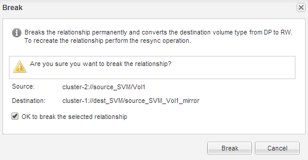

= SnapMirror 관계를 발전시킬 수 있습니다
:allow-uri-read: 
:icons: font
:imagesdir: ../media/

[role="lead"]
대상 볼륨을 활성화하려면 SnapMirror 관계를 중지 및 해제해야 합니다. 일시 중지 후에는 SnapMirror 데이터 전송이 비활성화됩니다.

.시작하기 전에
타겟 볼륨은 대상 SVM 네임스페이스에 마운트되어야 합니다.

.이 작업에 대해
대상 * 클러스터에서 이 작업을 수행해야 합니다.

.단계
. 실행 중인 System Manager 버전에 따라 다음 단계 중 하나를 수행하십시오.
+
** ONTAP 9.4 이하: * 보호 * > * 관계 * 를 클릭합니다.
** ONTAP 9.5부터 * 보호 * > * 볼륨 관계 * 를 클릭합니다.

. 소스 볼륨과 타겟 볼륨 간의 SnapMirror 관계를 선택합니다.
. 운영 * > * 정지 * 를 클릭하여 향후 데이터 전송을 비활성화합니다.
. 확인 확인란을 선택한 다음 * 정지 * 를 클릭합니다.
+
중지 작업에는 다소 시간이 걸릴 수 있으며 전송 상태가 로 표시될 때까지 SnapMirror 관계에 대한 다른 작업을 수행하지 않아야 합니다 `Quiesced`.

. Operations * > * Break * 를 클릭합니다.
. 확인 확인란을 선택한 다음 * Break * (휴식 *)를 클릭합니다.
+

+
SnapMirror 관계는 입니다 `Broken Off` 상태.

+
image::../media/break_verify.gif[부분 연결 상태의 SnapMirror 관계]

