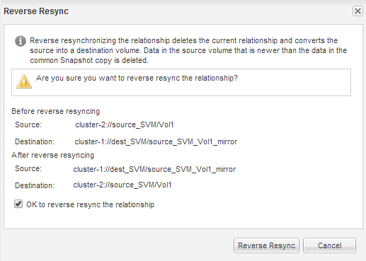

= 소스 볼륨을 재동기화합니다
:allow-uri-read: 
:icons: font
:imagesdir: ../media/

[role="lead"]
소스 볼륨이 온라인 상태일 때 대상 볼륨과 소스 볼륨 간의 데이터를 재동기화하여 대상 볼륨의 최신 데이터를 복제해야 합니다.

.시작하기 전에
소스 볼륨이 온라인 상태여야 합니다.

.이 작업에 대해
대상 * 클러스터에서 작업을 수행해야 합니다.

다음 이미지는 활성 대상 볼륨에서 읽기 전용 소스 볼륨으로 데이터가 복제되었음을 보여 줍니다.

image::../media/reverse_resync_2555.gif[다음 이미지는 활성 대상 볼륨에서 읽기 전용 소스 볼륨으로 데이터가 복제되는 것을 보여 줍니다]

.단계
. 실행 중인 System Manager 버전에 따라 다음 단계 중 하나를 수행하십시오.
+
** ONTAP 9.4 이하: * 보호 * > * 관계 * 를 클릭합니다.
** ONTAP 9.5부터 * 보호 * > * 볼륨 관계 * 를 클릭합니다.

. 소스 볼륨과 타겟 볼륨 간의 SnapMirror 관계를 선택합니다.
. SnapMirror 관계에 대해 구성된 전송 일정과 정책을 기록해 둡니다.
. Operations * > * Reverse Resync * 를 클릭합니다.
. 확인 확인란을 선택한 다음 * 역방향 재동기화 * 를 클릭합니다.
+

+
ONTAP 9.3부터 관계의 SnapMirror 정책이 로 설정됩니다 `MirrorAllSnapshots` 미러 스케줄이 로 설정되어 있습니다 `None`.

+
ONTAP 9.2 이하를 실행 중인 경우 관계의 SnapMirror 정책이 로 설정됩니다 `DPDefault` 미러 스케줄이 로 설정되어 있습니다 `None`.

. 소스 클러스터에서 원본 SnapMirror 관계의 보호 구성과 일치하는 SnapMirror 정책 및 일정을 지정합니다.
+
.. 실행 중인 System Manager 버전에 따라 다음 단계 중 하나를 수행하십시오.
+
*** ONTAP 9.4 이하: * 보호 * > * 관계 * 를 클릭합니다.
*** ONTAP 9.5부터 * 보호 * > * 볼륨 관계 * 를 클릭합니다.

.. 재동기화된 소스 볼륨과 타겟 볼륨 간의 SnapMirror 관계를 선택한 다음 * 편집 * 을 클릭합니다.
.. SnapMirror 정책 및 일정을 선택하고 * OK * 를 클릭합니다.

