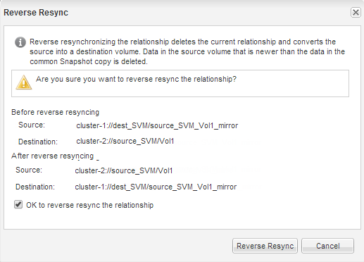

= 소스 볼륨을 다시 활성화합니다
:allow-uri-read: 
:icons: font
:imagesdir: ../media/

[role="lead"]
대상 볼륨에서 소스 볼륨으로 데이터를 재동기화한 후 SnapMirror 관계를 끊어 소스 볼륨을 활성화해야 합니다. 다시 활성화된 소스 볼륨을 보호하기 위해 대상 볼륨을 재동기화해야 합니다.

.이 작업에 대해
중단 및 역방향 재동기화 작업은 모두 * 소스 * 클러스터에서 수행됩니다.

다음 이미지는 SnapMirror 관계를 분리할 때 소스 볼륨과 타겟 볼륨이 읽기/쓰임을 보여 줍니다. 역방향 재동기화 작업 후 데이터는 활성 소스 볼륨에서 읽기 전용 타겟 볼륨으로 복제됩니다.

image::../media/reactivatng_source.gif[이미지는 SnapMirror 중단 및 재동기화 작업을 보여 줍니다]

.단계
. 실행 중인 System Manager 버전에 따라 다음 단계 중 하나를 수행하십시오.
+
** ONTAP 9.4 이하: * 보호 * > * 관계 * 를 클릭합니다.
** ONTAP 9.5부터 * 보호 * > * 볼륨 관계 * 를 클릭합니다.

. 소스 볼륨과 타겟 볼륨 간의 SnapMirror 관계를 선택합니다.
. 작업 * > * 정지 * 를 클릭합니다.
. 확인 확인란을 선택한 다음 * 정지 * 를 클릭합니다.
. Operations * > * Break * 를 클릭합니다.
. 확인 확인란을 선택한 다음 * Break * (휴식 *)를 클릭합니다.
+
image::../media/snapmirror_return_break.gif[분리 대화 상자를 보여 주는 스크린샷]

. Operations * > * Reverse Resync * 를 클릭합니다.
. 확인 확인란을 선택한 다음 * 역방향 재동기화 * 를 클릭합니다.
+

+
ONTAP 9.3부터 관계의 SnapMirror 정책이 로 설정됩니다 `MirrorAllSnapshots` 그리고 SnapMirror 일정이 로 설정되어 있습니다 `None`.

+
ONTAP 9.2 이하를 실행 중인 경우 관계의 SnapMirror 정책이 로 설정됩니다 `DPDefault` 그리고 SnapMirror 일정이 로 설정되어 있습니다 `None`.

. 볼륨 페이지에서 소스 볼륨으로 이동하여 생성한 SnapMirror 관계가 나열되고 관계 상태가 인지 확인합니다 `Snapmirrored`.
. 대상 클러스터에서 새 SnapMirror 관계에 대한 원래 SnapMirror 관계의 보호 구성과 일치하는 SnapMirror 정책 및 일정을 지정합니다.
+
.. 실행 중인 System Manager 버전에 따라 다음 단계 중 하나를 수행하십시오.
+
*** ONTAP 9.4 이하: * 보호 * > * 관계 * 를 클릭합니다.
*** ONTAP 9.5부터 * 보호 * > * 볼륨 관계 * 를 클릭합니다.

.. 재활성화된 소스와 대상 볼륨 간의 SnapMirror 관계를 선택한 다음 * 편집 * 을 클릭합니다.
.. SnapMirror 정책 및 일정을 선택하고 * OK * 를 클릭합니다.

.결과
소스 볼륨은 읽기/쓰기 액세스 권한을 가지고 있으며 대상 볼륨에 의해 보호됩니다.
