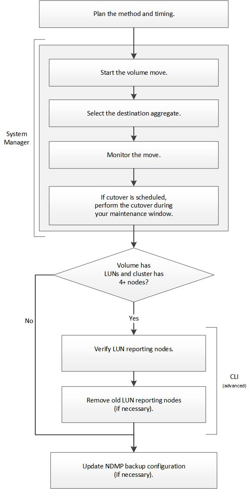

= 볼륨 이동 워크플로우
:allow-uri-read: 
:icons: font
:imagesdir: ../media/

[role="lead"]
ONTAP 9.7 이하와 함께 ONTAP System Manager_CLASSIC_INTERFACE를 사용하여 볼륨을 이동할 수 있습니다.

볼륨을 이동하기 전에 볼륨 이동 작업의 방법을 선택하고 작업 타이밍을 계획해야 합니다. 이동 후에는 NDMP 백업 구성을 업데이트해야 할 수 있습니다.

== ONTAP에서 이 작업을 수행하는 다른 방법

|===

| 을 사용하여 이 워크플로를 완료하려면... | 자세한 내용은... 

 a| 
재설계된 System Manager(ONTAP 9.7 이상에서 사용 가능)
 a| 
https://docs.netapp.com/us-en/ontap/volumes/manage-volumes-task.html["볼륨 관리"^]

 a| 
ONTAP 명령줄 인터페이스입니다
 a| 
https://docs.netapp.com/us-en/ontap/volumes/index.html["논리적 스토리지 관리"^]

|===