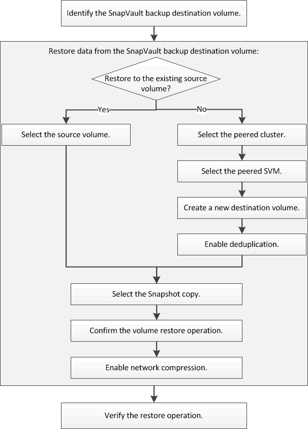

= 볼륨 복원 워크플로우
:allow-uri-read: 
:icons: font
:imagesdir: ../media/

[role="lead"]
소스 볼륨을 사용할 수 없거나 데이터가 손상된 경우 SnapVault 백업에서 복원을 수행할 수 있습니다. SnapVault 백업에서 볼륨을 복원하려면 SnapVault 대상 볼륨을 선택하고 새 볼륨이나 기존 볼륨으로 복원하며 복원 작업을 확인해야 합니다.

SnapVault 백업 관계를 관리하고 다른 데이터 보호 방법을 사용하여 데이터 리소스의 가용성을 보호하는 데 도움이 되는 추가 정보가 제공됩니다.

* xref:../volume-disaster-prep/index.html[볼륨 재해 복구 준비]
+
재해 복구 준비 시 다른 ONTAP 클러스터에서 대상 볼륨을 빠르게 구성하는 방법에 대한 설명은 에 나와 있습니다.

* xref:../volume-disaster-recovery/index.html[볼륨 재해 복구]
+
재해 발생 후 다른 ONTAP 클러스터에서 대상 볼륨을 빠르게 활성화하는 방법과 복구 후 소스 볼륨을 다시 활성화하여 SnapMirror 관계를 원래 상태로 복원하는 방법에 대해 설명합니다.

